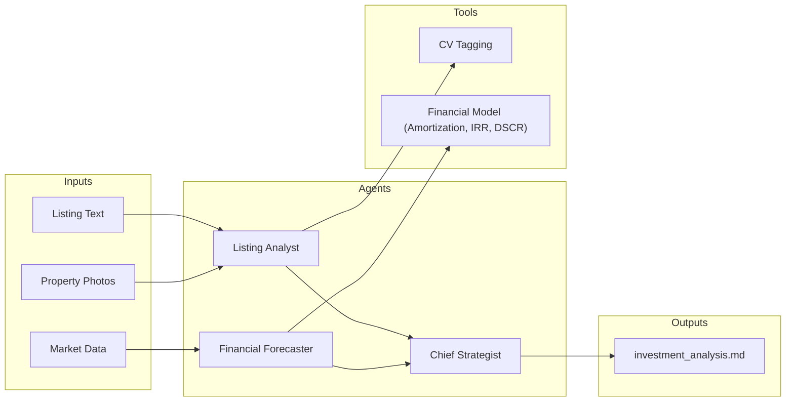
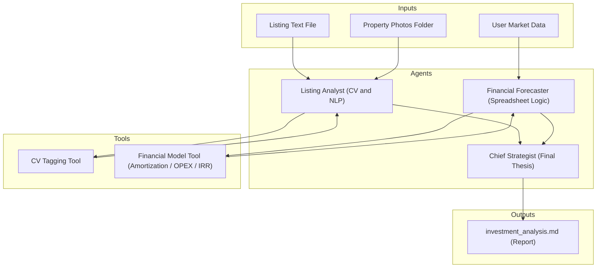
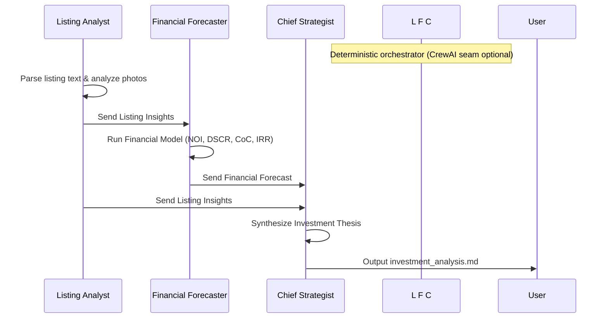
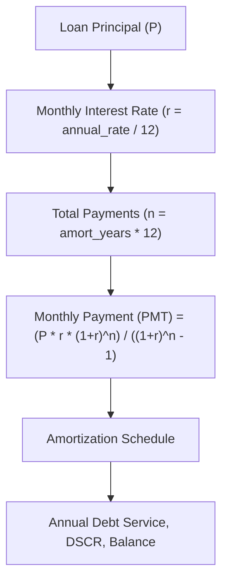

[](https://codecov.io/gh/rogerbooto/ai-real-estate-deal-analyzer)


[](https://github.com/rogerbooto/ai-real-estate-deal-analyzer/releases)

# The AI Real Estate Deal Analyzer

A deterministic-first investment co-pilot that ingests a real estate listing (text, HTML, and photos) and user-provided financial data to perform a rigorous, Grant Cardone–inspired investment analysis — producing a comprehensive financial breakdown, media insights, and a human-readable investment thesis.

This project is a portfolio piece designed to showcase a modern, agent-seamed architecture for complex decision-making and analysis. The core pipeline is **fully deterministic and reproducible**; AI layers (vision providers, CrewAI orchestration) are opt-in seams that default to deterministic stubs.

---

## Quick Start

Run the demo in **one line**:

```bash
git clone https://github.com/rogerbooto/ai-real-estate-deal-analyzer.git && cd ai-real-estate-deal-analyzer && python3 -m venv .venv && source .venv/bin/activate && pip install -r requirements.txt && python main.py
```

Expected output:

```text
Running AI Real Estate Deal Analyzer (V2)...
Report written to investment_analysis.md
Thesis verdict: DECLINE
```

> With no arguments, `main.py` underwrites the committed sample bundle at `data/sample_listings/36_kelly_moncton/` — a $399,900 legal up/down duplex in Moncton, NB. The bundle holds `listing.txt`, `photos/`, and `inputs.json` (financing, per-unit income, opex), so the listing, the photos, and the financials all describe the same deal. Pass `--config`, `--listing`, or `--photos` to point at your own.

### Demo Artifacts

* Sample deal bundles under `data/sample_listings/`:
  * `36_kelly_moncton/` — **the default demo** (listing.txt, photos/, inputs.json); a $399,900 two-unit duplex, underwritable end-to-end
  * `47_perrot_shediac/` — advisor fixture (listing.txt, photos/, finance.json); a single-family leasehold mini-home with advisor-shaped scoring inputs, not a full `FinancialInputs` config
* Example JSON artifacts: `data/examples/` (forecast, insights, media, thesis)
* Example outputs: `artifacts/*.md` / `artifacts/*.pdf` (e.g., `36_kelly_analysis.md`, `20_gallagher_analysis.md`)

### Command-Line Interfaces

Beyond `main.py`, three CLIs cover ingestion, reporting, and multi-deal advising (run as modules; see note on packaging below):

```bash
# Ingest a listing (file or URL) with optional media download & media intelligence
python -m src.cli.ingest_cli --file listing.html --photos ./photos --media-intel 1

# Render a Markdown investment report from JSON artifacts
python -m src.cli.report_cli --forecast forecast.json --insights insights.json --out report.md

# Rank multiple deals and summarize a portfolio (directory bundles or config JSONs)
python -m src.cli.advisor_cli --dir data/sample_listings/47_perrot_shediac --out out/advisor_output.json --markdown
```

> `pyproject.toml` declares `ingest-listing`, `deal-report`, and `deal-advisor` console scripts. After `pip install -e .` these resolve directly (`ingest-listing --help`, etc.); the `python -m src.cli.*` forms above remain valid if you prefer not to install the package.

---

## Documentation Index

This section links to in-depth READMEs for each `src/` subfolder.

| Folder             | Description                                                                                          | Link                                                   |
| ------------------ | ---------------------------------------------------------------------------------------------------- | ------------------------------------------------------ |
| **schemas/**       | Pydantic models defining all data contracts (inputs, forecasts, listings, media, market scenarios).  | [schemas/README.md](src/schemas/README.md)             |
| **core/**          | Deterministic finance engine, ingestion, normalization, CV, media, advisor, and intelligence logic.  | [core/README.md](src/core/README.md)                   |
| **cli/**           | Command-line entry points: listing ingest, report rendering, multi-deal advisor.                     | [cli/README.md](src/cli/README.md)                     |
| **orchestrators/** | End-to-end pipeline coordinators for deterministic and (seamed) CrewAI modes.                        | [orchestrators/README.md](src/orchestrators/README.md) |
| **agents/**        | High-level wrappers managing listing, finance, and strategy tasks.                                   | [agents/README.md](src/agents/README.md)               |
| **core/reports/**  | Markdown report generator for forecasts, media insights, and investment theses.                      | [core/reports/README.md](src/core/reports/README.md)   |
| **inputs/**        | Input loading, validation, and environment override logic.                                           | [inputs/README.md](src/inputs/README.md)               |
| **market/**        | Market snapshot, hypothesis grid, and rejector; wired into the pipeline as the opt-in `--scenarios` overlay. | [market/README.md](src/market/README.md)               |

> Relationships: `inputs → orchestrators → agents → core → core/reports`, with `market` optional and `cli` as user-facing entry points.

---

## The Problem: Analysis Paralysis in Real Estate Investing

For an aspiring real estate investor, evaluating a potential deal is a time-consuming, manual, and error-prone process. It involves:

* Manually parsing property photos and descriptions.
* Scouring multiple websites for comparable sales ("comps").
* Plugging dozens of numbers into a complex spreadsheet.
* Making a high-stakes financial decision based on incomplete data and gut feeling.

This "analysis paralysis" prevents many would-be investors from ever taking action.

---

## The Solution: An Autonomous AI Co-pilot

This project solves the problem by deploying a team of specialized AI agents that work together to perform a comprehensive deal analysis in seconds. It acts as an expert co-pilot, handling the heavy lifting of data analysis and financial modeling, allowing the human investor to focus on the final decision.

The system's unique value is its **opinionated financial model**, which implements the core principles of Grant Cardone's real estate investment methodology to calculate critical metrics like Net Operating Income (NOI), Cash-on-Cash Return, and Debt Service Coverage Ratio (DSCR).

---

## High-Level Architecture

At a glance, the system is a multi-agent pipeline with a **deterministic orchestrator by default** and a **CrewAI seam** for optional LLM-backed runs (`--engine crewai`; currently a parity shell that validates the environment and delegates to the same deterministic math). Each agent specializes in one domain, and the Chief Strategist synthesizes all findings into a final investment thesis.


```mermaid
flowchart LR
    subgraph Inputs
        A["Listing Text"]
        B["Property Photos"]
        C["Market Data"]
    end

    subgraph Agents
        L["Listing Analyst"]
        F["Financial Forecaster"]
        S["Chief Strategist"]
    end

    subgraph Tools
        T1["CV Tagging"]
        T2["Financial Model (Amortization, IRR, DSCR)"]
    end

    subgraph Outputs
        O["investment_analysis.md"]
    end

    A --> L
    B --> L
    C --> F
    L --> T1
    F --> T2
    L --> S
    F --> S
    S --> O
```

---

## Technical Architecture

The system is built as a **multi-agent pipeline** with clear separation of concerns, where each agent is an expert in its domain. Orchestration is deterministic by default; a CrewAI-based engine is available as a seam for future LLM reasoning.

The primary agents are:

* **Listing Analyst:** Analyzes property photos (deterministic CV tagging, with provider seams for AI vision) and listing text to extract key features and data points.
* **Financial Forecaster:** A financial modeling expert that implements the core investment spreadsheet logic, calculating NOI, cash flow, and return metrics.
* **Chief Strategist:** The final decision-maker that synthesizes all data into a clear, human-readable investment thesis (rule-based today).

*(Note: live market research is out of scope; financial inputs are provided locally. Listing ingestion supports local files and — behind an explicit opt-in fetch policy with robots.txt respect — remote URLs.)*

---

## System Overview


```mermaid
flowchart TD
    subgraph Inputs
        A["Listing Text File"]
        B["Property Photos Folder"]
        C["User Market Data"]
    end

    subgraph Agents
        D["Listing Analyst (CV and NLP)"]
        E["Financial Forecaster (Spreadsheet Logic)"]
        F["Chief Strategist (Final Thesis)"]
    end

    subgraph Tools
        G["CV Tagging Tool"]
        H["Financial Model Tool (Amortization / OPEX / IRR)"]
    end

    subgraph Outputs
        I["investment_analysis.md (Report)"]
    end

    A --> D
    B --> D
    D --> G
    D --> F
    C --> E
    G --> D
    E --> H
    E --> F
    H --> E
    F --> I
```

---

## Agent Collaboration


```mermaid
sequenceDiagram
    participant L as Listing Analyst
    participant F as Financial Forecaster
    participant C as Chief Strategist

    Note over L F C: Deterministic orchestrator (CrewAI seam optional)

    L->>L: Parse listing text & analyze photos
    L->>F: Send Listing Insights
    F->>F: Run Financial Model (NOI, DSCR, CoC, IRR)
    F->>C: Send Financial Forecast
    L->>C: Send Listing Insights
    C->>C: Synthesize Investment Thesis
    C->>User: Output investment_analysis.md
```

---

## How We Model Debt Service

We use a standard **loan amortization model** to compute annual debt service:


```mermaid
flowchart TD
    A["Loan Principal (P)"] --> B["Monthly Interest Rate (r = annual_rate / 12)"]
    B --> C["Total Payments (n = amort_years * 12)"]
    C --> D["Monthly Payment (PMT) = (P * r * (1+r)^n) / ((1+r)^n - 1)"]
    D --> E["Amortization Schedule"]
    E --> F["Annual Debt Service, DSCR, Balance"]
```

This model feeds into our per-year pro forma:

* **Debt Service** = principal + interest for that year
* **DSCR** = NOI ÷ Debt Service
* **Balance After Year N** = outstanding loan principal

---

## Tech Stack

* **Language:** Python 3.10
* **Orchestration:** Deterministic pipeline (default) + CrewAI seam (optional engine)
* **Computer Vision:** Deterministic filename/heuristic tagging with closed-set ontology; provider seams for `vision`/`llm` stubs and user-registered ONNX models; perceptual-hash media intelligence (Pillow)
* **Ingestion:** BeautifulSoup HTML parsing, address parsing via `usaddress`, robots-respecting fetch policy
* **Data Modeling:** Pydantic v2
* **Testing:** Pytest (+ coverage via pytest-cov / Codecov)
* **Lint/Type:** Ruff, mypy (strict)
* **Deps:** `requirements.txt` (runtime) + `requirements-dev.txt` (dev)
* **Packaging:** `pyproject.toml` (console-script metadata incomplete; run CLIs via `python -m`)

---

## Project Goals

* Demonstrate mastery of **agentic design patterns**.
* Implement a **transparent and opinionated financial model**.
* Deliver professional-quality code, tests, and documentation in a public repo.

---

## Usage Example

The demo runs on the committed `36_kelly_moncton` bundle (see [Demo Artifacts](#demo-artifacts)); hardcoded inputs are only a last-resort fallback if that bundle is missing.
You can run the full pipeline (Listing Analyst → Financial Forecaster → Chief Strategist) directly:

```bash
# Run demo analysis
python main.py

# Or with explicit config/assets
python main.py --config data/sample_listings/36_kelly_moncton/inputs.json --out out.md --horizon 10 \
               --listing data/sample_listings/36_kelly_moncton/listing.txt --photos data/sample_listings/36_kelly_moncton/photos

# Opt-in Market Scenarios overlay (deterministic what-if scenarios)
python main.py --config data/sample_listings/36_kelly_moncton/inputs.json --scenarios
```

Expected console output:

```text
Running AI Real Estate Deal Analyzer (V2)...
Report written to investment_analysis.md
Thesis verdict: DECLINE
```

This generates a Markdown report in the project root:

* **`investment_analysis.md`** → Contains the financial forecast, year-by-year breakdown, and final investment thesis.

### Market Scenarios (Opt-In Overlay)

To enable the optional "Market Scenarios" what-if analysis, pass `--scenarios` or set `AIREAL_SCENARIOS=1`. **Requires** either:

* A `market` block in the JSON config (region, vacancy_rate, cap_rate, rent_growth, expense_growth, interest_rate — all as fractions), or
* `inputs.market.cap_rate_purchase` set to a non-null value (fallback derivation uses user assumptions).

Scenarios are **deterministic**: same seed and inputs produce identical what-if outcomes. They are **not** predictions or live market data, but prior-weighted what-if calculations over a fixed hypothesis grid anchored to your assumptions.

### Example Report Snippet

```markdown
# Investment Analysis Report

**Property Address:** 123 Main St
**Verdict:** CONDITIONAL

## Purchase Metrics
- Cap Rate: 5.12%
- DSCR: 1.05
- CoC Return: 6.8%

## 10-Year Returns
- IRR (10yr): 11.2%
- Equity Multiple (10yr): 2.1x
```

*(Numbers are illustrative — your run may differ depending on inputs.)*

---

## Developer Setup

To get started as a contributor:

**1. Clone the repository**

```bash
git clone git clone https://github.com/rogerbooto/ai-real-estate-deal-analyzer.git
cd ai-real-estate-deal-analyzer
```

**2. Create a virtual environment**

```bash
python -m venv .venv
source .venv/bin/activate   # Linux/Mac
.venv\Scripts\activate      # Windows
```

**3. Install dependencies**

```bash
pip install -r requirements.txt
```

For development (with tests, linting, typing):

```bash
pip install -r requirements.txt -r requirements-dev.txt
```

> Note: `pip install -e .` is supported and installs the `ingest-listing`, `deal-report`, and `deal-advisor` console scripts. Runtime dependencies still come from the requirements files (this matches CI), so install those first, then `pip install -e .` for the entry points.

---

## Testing & Validation

This project is built test-first, with coverage for amortization, financial modeling, agents, and end-to-end flows.

Run the test suite with:

```bash
pytest -q
```

All tests must pass before merging new code.

Lint & types:

```bash
ruff check .
mypy --strict src
```

Coverage is enforced via `pytest.ini` (80% minimum over `src/core`, `src/schemas`, `src/market`; network/vision glue is excluded via `.coveragerc`) and uploaded to Codecov in CI:

```ini
# pytest.ini (excerpt)
[pytest]
addopts =
    -q
    --cov=src/market --cov=src/schemas --cov=src/core
    --cov-report=term-missing --cov-report=xml
    --cov-fail-under=80 --cov-config=.coveragerc
testpaths = tests
```

**CI Status & Coverage:** See badges above. All PRs must pass CI, lint, type checks, and meet coverage thresholds.

---

## Roadmap

* **V1 (MVP) — ✅ Implemented**

  * Local text + photo ingestion via `core.ingest` and `agents.listing_analyst`
  * Deterministic financial modeling using `core.finance.engine` (amortization, IO phases, refi, IRR)
  * Agent orchestration and thesis output through `orchestrators.crew`
  * Markdown report generation (`core.reports.generator`) with baseline / stress / NOI-based valuation tables
  * Test coverage (≥80% on covered modules) and CI/CD via GitHub Actions + Codecov
  * Modular documentation across `schemas`, `core`, `cli`, `agents`, `orchestrators`, `inputs`, and `market`
  * Environment-driven configuration (`AIREAL_*` flags)

* **V2 (Shipped since v0.1.0) — ✅ Implemented**

  * End-to-end **media pipeline**: HTML media discovery → filtered download → `MediaBundle` manifest (`core.media`)
  * **Media intelligence** (opt-in): perceptual-hash near-duplicate detection, quality scoring, palette extraction, hero-image ranking
  * **Listing ingestion** from file or URL with fetch policy, robots.txt respect, caching, and optional JS rendering (`core.ingest`, `ingest-listing` CLI)
  * **CV tagging v2**: closed-set amenities/defects ontology, provider seams (`local` / `vision` / `llm` stubs, user-registered ONNX), per-provider caching
  * **Address parsing** (US/CA) with `usaddress` + DOM/schema.org hints (`core.normalize.address`)
  * **Deal intelligence & advisor**: composite scoring, deal fusion, narrative builder, multi-deal ranking and portfolio summary (`core.intelligence`, `core.advisor`, `deal-advisor` CLI)
  * **Report CLI** rendering reports from JSON artifacts, including media overview sections

* **V3 (Shipped since 2026-07-24) — ✅ Market Scenarios Complete**

  * **Market Scenarios overlay** (opt-in `--scenarios` / `AIREAL_SCENARIOS` / `run.scenarios`): generates prior-weighted what-if outcomes using the market hypothesis grid composed with the frozen finance engine; appends a "Market Scenarios" section to the report with top-N scenarios, prior-weighted bands, and disclosure caveats. Default OFF → byte-identical to V2 output. Scenarios are deterministic what-ifs, not predictions/live data.

* **V4 (Planned / Not yet implemented)**

  * Real LLM/vision provider integration behind the existing seams (CrewAI kickoff, AI photo tagging beyond deterministic stubs)
  * Live market data ingestion (regional income, cap-rate drift, comps) — scenarios currently run on user-supplied snapshot only
  * Streamlit or web UI for interactive scenario exploration and parameter sensitivity
  * Expanded scenario reporting and stress-test visualizations

---

_Last reconciled: 2026-07-24 against main @ e4716df (post-Wave-2 Market Scenarios implementation)._
