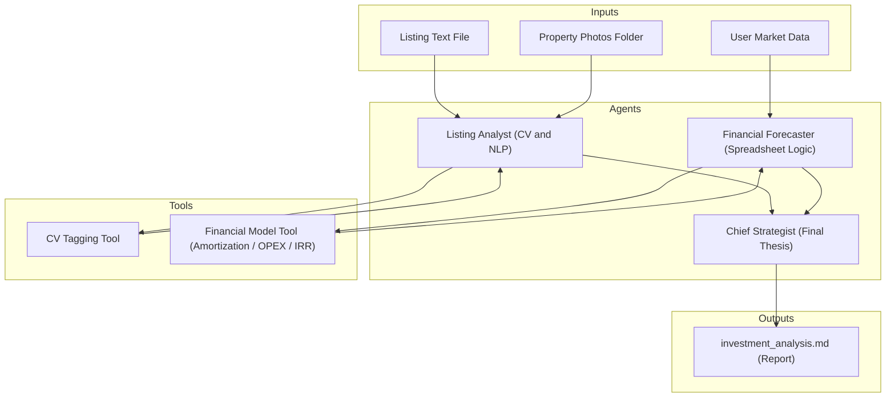
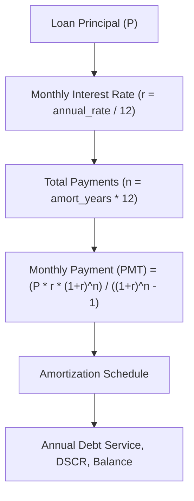

# The AI Real Estate Deal Analyzer

An autonomous AI co-pilot that ingests a real estate listing and user-provided market data to perform a rigorous, Grant Cardone–inspired investment analysis, generating a comprehensive financial breakdown and a human-readable investment thesis.

This project is a portfolio piece designed to showcase a modern, multi-agent AI architecture for complex decision-making and analysis.

---

## The Problem: Analysis Paralysis in Real Estate Investing

For an aspiring real estate investor, evaluating a potential deal is a time-consuming, manual, and error-prone process. It involves:

* Manually parsing property photos and descriptions.
* Scouring multiple websites for comparable sales ("comps").
* Plugging dozens of numbers into a complex spreadsheet.
* Making a high-stakes financial decision based on incomplete data and gut feeling.

This "analysis paralysis" prevents many would-be investors from ever taking action.

---

## The Solution: An Autonomous AI Co-pilot

This project solves the problem by deploying a team of specialized AI agents that work together to perform a comprehensive deal analysis in seconds. It acts as an expert co-pilot, handling the heavy lifting of data analysis and financial modeling, allowing the human investor to focus on the final decision.

The system's unique value is its **opinionated financial model**, which implements the core principles of Grant Cardone's real estate investment methodology to calculate critical metrics like Net Operating Income (NOI), Cash-on-Cash Return, and Debt Service Coverage Ratio (DSCR).

---

## Technical Architecture

The system is built as a **multi-agent system**, orchestrated using CrewAI. This pattern allows for a clear separation of concerns, where each agent is an expert in its domain.

The primary agents are:

* **Listing Analyst:** A Computer Vision expert that analyzes property photos and listing text to extract key features and data points.
* **Financial Forecaster:** A financial modeling expert that implements the core investment spreadsheet logic, calculating NOI, cash flow, and return metrics.
* **Chief Strategist:** The final decision-maker that synthesizes all data into a clear, human-readable investment thesis.

*(Note: In V1, market research and live data scraping are out of scope; inputs are provided locally.)*

---

## System Overview



---

## Agent Collaboration


---

## How We Model Debt Service

We use a standard **loan amortization model** to compute annual debt service:



This model feeds into our per-year pro forma:

* **Debt Service** = principal + interest for that year
* **DSCR** = NOI ÷ Debt Service
* **Balance After Year N** = outstanding loan principal

---

## Tech Stack

* **Language:** Python
* **Orchestration:** CrewAI
* **AI Models:** Computer Vision (CLIP-based tagging), LLM agents
* **Data Modeling:** Pydantic v2
* **Testing:** Pytest
* **Packaging:** `pyproject.toml` with Poetry-style dependency management

---

## Project Goals

* Demonstrate mastery of **agentic design patterns**.
* Implement a **transparent and opinionated financial model**.
* Deliver professional-quality code, tests, and documentation in a public repo.

---

## Usage Example

The V1 demo comes with hardcoded sample inputs.
You can run the full pipeline (Listing Analyst → Financial Forecaster → Chief Strategist) directly:

```bash
# Run demo analysis
python main.py
```

Expected console output:

```text
Running AI Real Estate Deal Analyzer (V1 demo)...
Report written to investment_analysis.md
Thesis verdict: CONDITIONAL
```

This generates a Markdown report in the project root:

* **`investment_analysis.md`** → Contains the financial forecast, year-by-year breakdown, and final investment thesis.

### Example Report Snippet

```markdown
# Investment Analysis Report

**Property Address:** 123 Main St  
**Verdict:** CONDITIONAL  

## Purchase Metrics
- Cap Rate: 5.12%
- DSCR: 1.05
- CoC Return: 6.8%

## 10-Year Returns
- IRR (10yr): 11.2%
- Equity Multiple (10yr): 2.1x
```

*(Numbers are illustrative — your run may differ depending on inputs.)*

---
## Developer Setup
To get started as a contributor:

**1. Clone the repository**
```bash
git clone https://github.com/<your-username>/ai-real-estate-deal-analyzer.git
cd ai-real-estate-deal-analyzer
```

**2. Create a virtual environment**
```bash
python -m venv .venv
source .venv/bin/activate   # Linux/Mac
.venv\Scripts\activate      # Windows
```

**3. Install dependencies**

We use **Poetry-style dependencies via** `pyproject.toml`, but you can also install directly:

```bash
pip install -r requirements.txt
```

For development (with tests, linting, typing):
```bash
pip install -e .[dev]
```

---

## Testing & Validation

This project is built test-first, with coverage for amortization, financial modeling, agents, and end-to-end flows.

Run the test suite with:

```bash
pytest -q
```

Expected output (V1):

```text
......................
22 passed in 0.07s
```

All tests must pass before merging new code.

---

## Roadmap

* **V1 (MVP):**

  * Local text + photo ingestion
  * Deterministic financial modeling
  * Agent orchestration and thesis output
* **V2+:**

  * Live market data ingestion
  * Streamlit or web UI
  * Predictive modeling for valuation and rent growth

---
